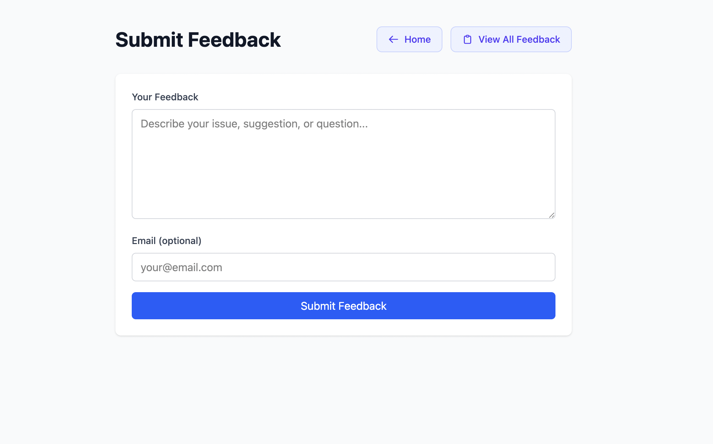
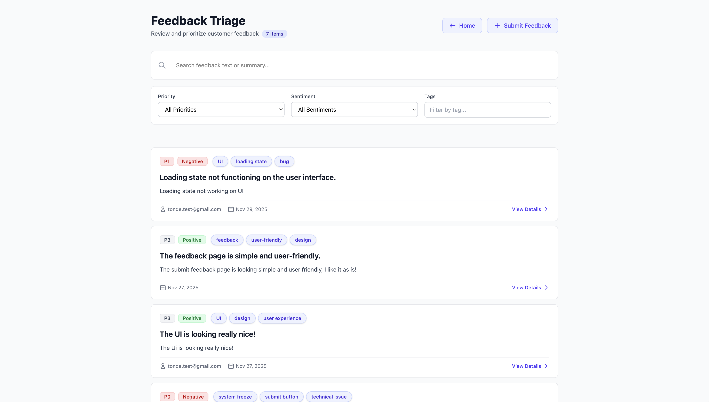
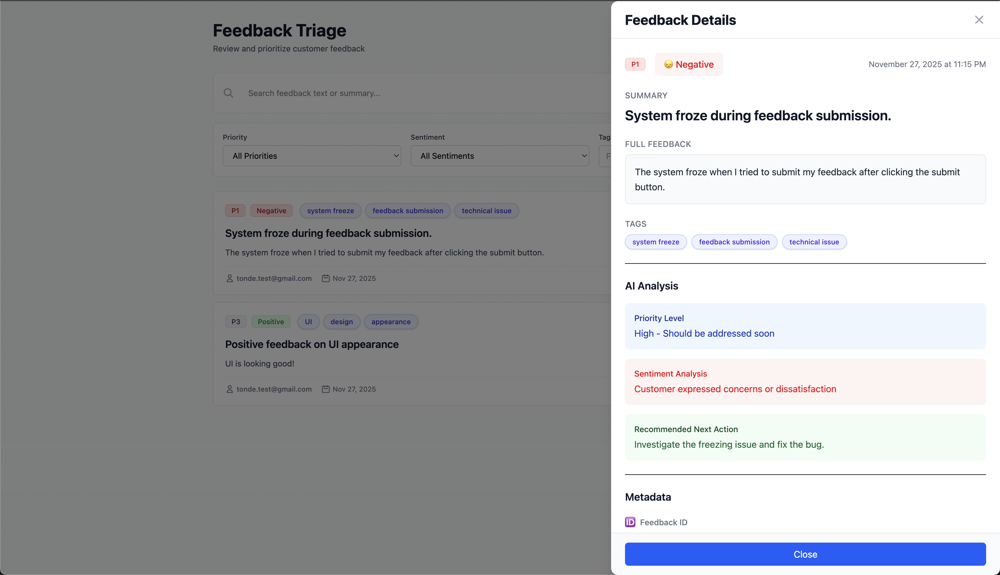

# OfferZen AI Feedback Triage App

> **📋 Assessment Project**: AI-powered feedback analysis and prioritization system

An intelligent feedback triage application that uses OpenAI gpt-4o-mini to automatically analyze, categorize, and prioritize user feedback. Built as an assessment project demonstrating full-stack TypeScript development, clean architecture, and production-ready practices.

---

## Architecture Overview

The application follows a **clean layered architecture**:

```
UI (Next.js Pages)
  ↓
API Routes (HTTP handling, validation)
  ↓
Controllers (Business logic)
  ↓
Services (AI integration) + Repositories (Database)
  ↓
PostgreSQL (Data persistence)
```

## 👋 For Recruiters: Quick Start Guide

### 🚀 Run This Project in 5 Minutes

**Prerequisites:**
- [Docker Desktop](https://www.docker.com/products/docker-desktop) installed
- [OpenAI API Key](https://platform.openai.com/api-keys) (free account available)

**Steps:**

```bash
# 1. Clone the repository
git clone https://github.com/Pats101/Offerzen-ai-feedback-triage-app.git
cd Offerzen-ai-feedback-triage-app

# 2. Set your OpenAI API key
echo "OPENAI_API_KEY=your_openai_api_key_here" > .env

# 3. Start the application
docker-compose up --build

# 4. Open http://localhost:3001 in your browser
```

**What you'll see:**
- ✅ Modern, responsive UI with Tailwind CSS
- ✅ AI-powered feedback analysis (summary, sentiment, priority, tags)
- ✅ Filtering by priority, sentiment, and tags
- ✅ Free-text search across feedback
- ✅ Detailed feedback view with full analysis

**To stop:** `docker-compose down`

---

### 📊 What This Project Demonstrates

| Skill | Implementation |
|-------|----------------|
| **Full-Stack TypeScript** | End-to-end type safety from database to UI |
| **Clean Architecture** | Repository pattern, controllers, mappers, services |
| **AI Integration** | OpenAI gpt-4o-mini with retry logic and error handling |
| **Database Design** | PostgreSQL with Prisma ORM, migrations, indexes |
| **Testing** | Jest + React Testing Library, 100% coverage (25 tests) |
| **DevOps** | Docker, Docker Compose, GitHub Actions CI/CD |
| **Code Quality** | ESLint, Prettier, TypeScript strict mode |
| **API Design** | RESTful API with validation, pagination, filtering |
| **Error Handling** | Graceful degradation, structured logging |
| **Documentation** | Comprehensive docs, inline comments, architecture notes |

---

### 📁 Repository Structure

```
Offerzen-ai-feedback-triage-app/
├── src/
│   ├── controllers/       # Business logic layer
│   ├── repositories/      # Data access layer
│   ├── services/         # External services (AI, retry)
│   ├── mappers/          # Data transformation
│   ├── validators/       # Input validation (Zod)
│   └── pages/            # Next.js pages (UI + API routes)
├── prisma/
│   ├── schema.prisma     # Database schema
│   └── migrations/       # Database migrations
├── tests/                # 25 tests (100% coverage)
├── .github/workflows/    # CI/CD pipelines
└── docker-compose.yml    # Production setup
```

---

### 🔍 Key Features to Review

1. **AI Analysis** ([src/services/ai.ts](src/services/ai.ts))
   - OpenAI gpt-4o-mini integration with structured output
   - Retry logic with exponential backoff
   - Graceful error handling and fallbacks

2. **Clean Architecture** ([src/controllers/](src/controllers/), [src/repositories/](src/repositories/))
   - Separation of concerns
   - Repository pattern for data access
   - Testable, maintainable code structure

3. **Testing** ([tests/](tests/))
   - Unit tests for AI service
   - Integration tests for controllers
   - Component tests for UI

4. **CI/CD** ([.github/workflows/](.github/workflows/))
   - Automated testing and linting
   - Docker image builds
   - PR validation with quality checks

---

### 📄 Documentation

- **[SOLUTION.md](SOLUTION.md)** - Detailed solution walkthrough, architecture decisions
---

## ⚡ Features

### Core Features
- ✅ **Submit Feedback**: Web form with text and optional email
- ✅ **AI Analysis**: Automatic analysis (summary, sentiment, tags, priority, next action)
- ✅ **List & Filter**: Paginated feedback list with filtering
- ✅ **Search**: Free-text search across feedback and summaries
- ✅ **Feedback Details**: View individual feedback with full analysis

### Technical Features
- ✅ **Clean Architecture**: Repository pattern, controllers, mappers
- ✅ **Type Safety**: Full TypeScript coverage
- ✅ **Validation**: Zod schemas for request validation
- ✅ **Error Handling**: Graceful fallbacks and retry logic
- ✅ **Structured Logging**: Request IDs for debugging
- ✅ **Docker Support**: Production and development containers
- ✅ **CI/CD**: GitHub Actions workflows
- ✅ **100% Test Coverage**: 25 tests passing

---

## 🛠️ Tech Stack

- **Frontend**: Next.js 14, React, TypeScript, Tailwind CSS
- **Backend**: Next.js API Routes, TypeScript
- **Database**: PostgreSQL 15 with Prisma ORM
- **AI**: OpenAI gpt-4o-mini
- **Testing**: Jest, React Testing Library
- **DevOps**: Docker, Docker Compose, GitHub Actions

---

## 📖 Alternative: Manual Setup

<details>
<summary>Click to expand manual setup instructions (without Docker)</summary>

### Prerequisites
- Node.js 18+
- PostgreSQL 15+
- OpenAI API Key

### Setup

```bash
# 1. Clone and install
git clone https://github.com/Pats101/Offerzen-ai-feedback-triage-app.git
cd Offerzen-ai-feedback-triage-app
npm install

# 2. Create database
createdb feedback_triage

# 3. Configure environment
cp .env.example .env
# Edit .env with your DATABASE_URL and OPENAI_API_KEY

# 4. Run migrations
npx prisma migrate deploy
npx prisma generate

# 5. Start development server
npm run dev

# Open http://localhost:3001
```

### Available Scripts
- `npm run dev` - Start development server
- `npm test` - Run tests
- `npm run build` - Build for production
- `npm start` - Start production server
- `npm run lint` - Run linter

</details>

---

## 🔧 Troubleshooting

<details>
<summary>Common issues and solutions</summary>

### Docker Issues

**Port 3001 already in use:**
```bash
lsof -i :3001  # Find process
kill -9 <PID>  # Kill it
```

**Database connection failed:**
```bash
docker-compose ps              # Check status
docker-compose logs postgres   # View logs
docker-compose restart postgres # Restart
```

### Manual Setup Issues

**Missing Prisma client:**
```bash
npx prisma generate
```

**Migration failed:**
```bash
npx prisma migrate deploy
```

**OpenAI API errors:**
- Verify API key is set in `.env`
- Check account has credits
- Test with: `curl https://api.openai.com/v1/models -H "Authorization: Bearer $OPENAI_API_KEY"`

</details>

---

## 📞 Support

For issues or questions:
1. Check [SOLUTION.md](SOLUTION.md) for detailed documentation
2. Review troubleshooting section above
---

## 📜 License

This project is built as an assessment project for OfferZen.

🎥 Video Walkthrough
A short explanation of the system architecture, design decisions, and workflow.

---

## 📸 Please view screenshots for this project

### Welcome Page


### Submit Feedback



### List Feedback Page



### View Feedback Drawer



**Built with ❤️ by Patrick Ganhiwa** | [GitHub](https://github.com/Pats101) 
